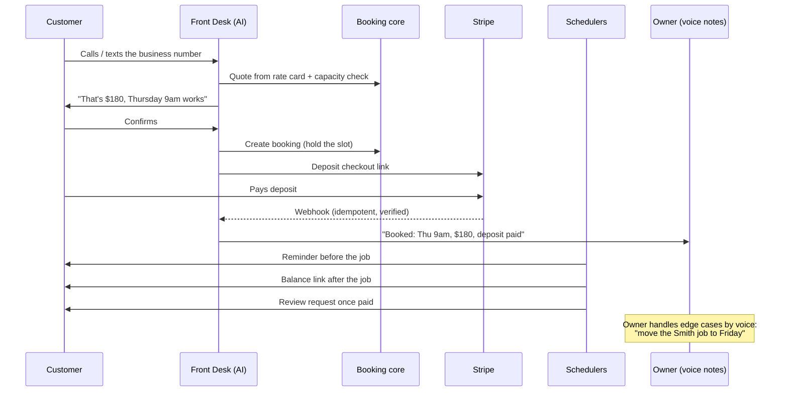
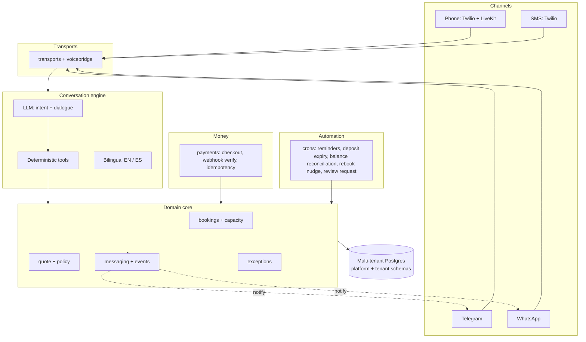

# front-desk-crm

> **A CRM that is a phone number, not a dashboard.** An AI receptionist answers a home-services company's calls and texts, quotes real prices, books the job, takes the deposit, sends reminders, collects the balance, and asks for the review. The owner runs the whole business from voice notes.

Owner-operated home-services businesses (think a cleaning company with 1 to 15 crew) run on a phone they can't answer. The owner is mid-job when a customer calls, the call goes to voicemail, and the customer books the next company on Google. Every missed call is a $150 to $400 job walking away. Existing software assumes the owner will sit at a dashboard. They won't. So this product has **no dashboard**: customers talk to an AI receptionist, and the owner runs everything from voice notes.

---

## Two faces, zero dashboards

| | Customer-facing | Owner-facing |
|---|---|---|
| **Surface** | A phone number + SMS | Telegram / WhatsApp voice notes |
| **Who drives** | AI receptionist | The owner, talking |
| **Does what** | Quotes, books, takes deposit, reminds, collects balance, requests review | Approves quotes, edits the rate card, handles exceptions, sees the day, all by voice |

---

## End-to-end job lifecycle

---

## System architecture

The LLM runs the **conversation**. It never runs the **money**. Every booking, price, and payment goes through a deterministic, schema-validated tool layer (`engine/tools.ts`), so the model can misread a sentence but it cannot misquote a price, double-book a slot, or charge the wrong card. Same trust boundary you'd put around any LLM that touches real dollars.

---

## Multi-tenant by construction

Two schema layers on one Postgres (Drizzle ORM):

- **Platform schema** shared across every business: locale packs, owner decisions, voice-call records, the cron registry.
- **Tenant schema** isolated per business: bookings, rate cards, owner confirmations, and per-channel client identities (SMS, Telegram, WhatsApp).

A new cleaning company is a row, not a deployment.

---

## Built for the messy real world

The hard part of a receptionist isn't the happy path, it's everything around it. Covered by an automated test suite (33 suites):

- **Money is idempotent** — Stripe webhook + deposit-expiry races can't double-charge or drop a payment (`stripe-idempotency`, `webhook-idempotency`, `expiry-race`).
- **Time is correct** — every reminder and slot respects the business's timezone (`timezone`).
- **Bilingual** — full English / Spanish dialogue, not just translated strings (`spanish`).
- **SMS-compliant** — honors STOP / opt-out keywords before sending (`stop-keyword`, `delivery-status`).
- **Owner authority is enforced** — only the verified owner can edit the rate card or approve exceptions (`owner-auth`, `rate-card-edit`).
- **Missed calls are recovered** — a missed call becomes an outbound text, not a lost job (`missed-call`, `rebook-nudge`).

---

## Stack

| Layer | Technology |
|---|---|
| Language | TypeScript (strict, `tsc --noEmit` clean) |
| Runtime | Supabase Edge Functions |
| Web framework | Hono |
| Database | Postgres + Drizzle ORM (multi-tenant) |
| Validation | Zod (every tool input + webhook payload) |
| Time | Luxon (timezone-correct scheduling) |
| Voice | Twilio + LiveKit (real-time) |
| Payments | Stripe (checkout, verified webhooks, idempotency) |
| Owner channel | Telegram + WhatsApp (voice-note transcription) |
| Tests | Vitest + Playwright |

---

Designed and built by [Joy Dong](https://www.joydong.org). An Ownly Network product.
